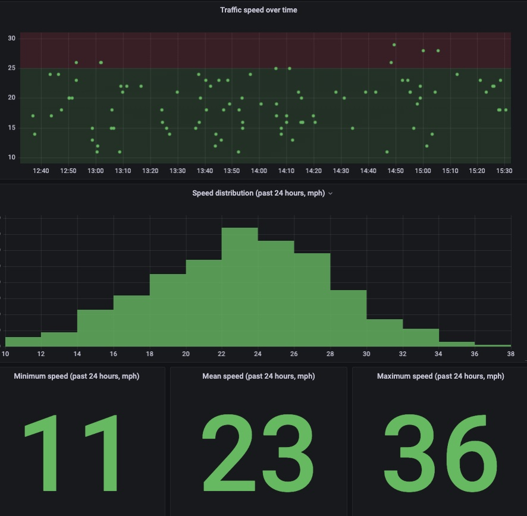
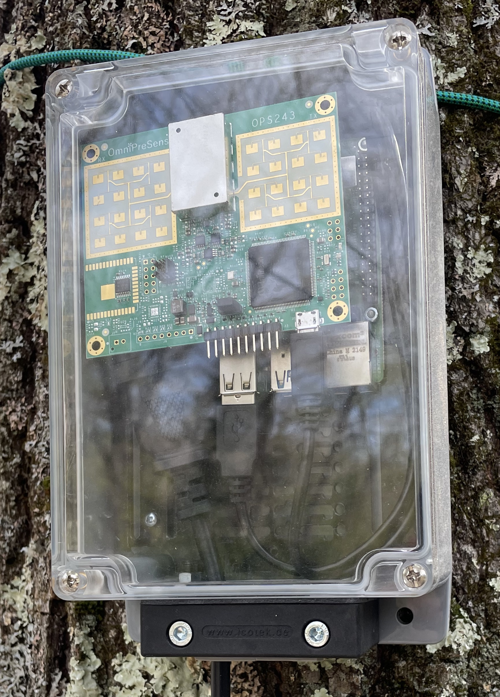

# raspberry-pi-speed-radar

This repo contains details to build your Raspberry Pi speed radar.

The device consists of a Raspberry Pi 4, powered via a USB charger, and an OmniPreSense OPS243-A Doppler Radar Sensor. Version 1 connects to a nearby wifi network, sends the collected data to AWS IoT Core, which in turn routes it to AWS Timestream, which is then queried by an AWS Managed Grafana dashboard to display results like this:



# Purpose
I wanted to see if we have a speeding problem on our street, so I decided to build a Raspberry Pi-based radar speed meter. It's based heavily on the steps outlined in https://www.hackster.io/rob-lauer/busted-create-an-ml-powered-speed-trap-b1e5d1, with modifications.

# Instructions
## Assemble the basics
1. Purchase and assemble the items in the [Hardware Inventory](#hardware-inventory). It should look something like: 
1. Download and install the Raspberry Pi Imager for your operating system: https://www.raspberrypi.org/downloads/.
1. Download the latest Ubuntu Server 64-bit image from https://ubuntu.com/download/raspberry-pi. Currently Ubuntu Server 22.04.2 64-bit for Raspberry Pi 4 is recommended: https://ubuntu.com/download/raspberry-pi/thank-you?version=22.04.2&architecture=server-arm64+raspi. The result should be a single `.img.xz` file.

## Setup AWS IoT, Timestream and Managed Grafana
The Raspberry Pi Speed Radar will send data to an AWS IoT endpoint, which will then route the data to a Timestream database. Managed Grafana will query the database and display results in a dashboard. I don't have time to document the procedure fully, but I learned everything I needed to know from an AWS tutorial video: https://www.youtube.com/watch?v=z8T4hAERuOg. I hope to provide more formally documented instructions in a later revision of this README.

## Then, depending on your OS, do the following:

### On Mac OS X
1. Unzip the `.xz` image file by double-clicking on it. The result should be a single `.img` file.
1. Mount the image with write capabilities by double-clicking on the `.img` file in Mac OS Finder. It mounts a `system-boot` volume.
1. From this repo, copy `ubuntu-system-boot/network-config.orig` to `ubuntu-system-boot/network-config` and modify the file with your local network settings.
1. In Terminal, replace your network settings from the previous step to the default settings file by running (from the main `raspberry-pi-speed-radar` directory):
   ```cat ubuntu-system-boot/network-config > /Volumes/system-boot/network-config```
1. Also from this repo, copy `ubuntu-system-boot/user-data.orig` to `ubuntu-system-boot/user-data`. Then, replace:
   * `<AWS_IOT_CERT_PEM_CONTENTS>` with the contents of the PEM certificate file obtained during AWS IoT setup.
   * `<AWS_IOT_PRIVATE_KEY_CONTENTS>` with the contents of the private key obtained during AWS IoT setup.
   * `<SPEED_THRESHOLD>` with the speed threshold (in mph) above which objects should be registered.
   * `<AWS_IOT_ENDPOINT>` with the value of the AWS IoT endpoint provided during AWS IoT setup.
   * `<AWS_IOT_CLIENT_ID>` with the value of the AWS IoT client ID provided during AWS IoT setup.
   * `<AWS_IOT_TOPIC>` with the value of the AWS IoT topic provided during AWS IoT setup.
1. In Terminal, append your first boot instructions from the previous step to the default first boot file by running (from the main `raspberry-pi-speed-radar` directory):
   ```cat ubuntu-system-boot/user-data >> /Volumes/system-boot/user-data```
1. In the Mac OS Finder, unmount the `system-boot` volume by right-clicking on `system-boot` and selecting `Eject "system-boot"`. The changes made will be saved in the `.img` file.
1. Assuming the `.img` files are on the Desktop, create a new modified `xz` archive by running (in Terminal):
   ```tar -cJf ~/Desktop/MODIFIED-<FULL_NAME_OF_MODIFIED_IMAGE_FILE>.xz ~/Desktop/<FULL_NAME_OF_MODIFIED_IMAGE_FILE>```
1. Insert the Pi MicroSD card into the USB MicroSD Card Reader and insert the card reader into a USB port on your computer. The volume should be automatically recognized by the Mac OS Finder.
1. Launch the Raspberry Pi Imager and press the "Choose OS" button. Select the custom image `MODIFIED-<FULL_NAME_OF_MODIFIED_IMAGE_FILE>.xz`.
1. Press the "Choose SD Card" button and select the destination SD card.
1. Finally, press the "Write" button to write the `.img.xz` file to SD card.
1. When complete, remove the MicroSD card from the USB MicroSD Card Reader and put the SD card in the Pi.
1. When ready, re-connect the power cable for the Raspberry Pi. The `bootstrap.sh` script will execute and install the radar software.After about 5 minutes, the radar will be ready.

### On Windows
1. TBD

### On Linux
1. TBD

<a href="#hardware-inventory"></a>
# Hardware Inventory
* 1 Raspberry Pi 4B, 8GB: https://www.amazon.com/gp/product/B0899VXM8F
* 1 Outdoor IoT Enclosure for Raspberry Pi & Development Boards: https://www.amazon.com/gp/product/B09TRZ5BTB
* 1 SanDisk 128GB Extreme microSDXC UHS-I Memory Card with Adapter: https://www.amazon.com/gp/product/B09X7BK27V
* 1 CableCreation 6 inch USB C Cable Short, Short USB to USB C Cable 3A Fast Charging Cable, Braided USB C Male to USB Male Cable for Power Bank, Galaxy S23, iPad Pro iPad Mini S22 S21 Z Flip, etc, Gray: https://www.amazon.com/gp/product/B01CZVEUIE
* 1 StarTech.com 6in (15cm) USB C Charging Cable Right Angle - 60W PD 3A - Heavy Duty Fast Charge USB-C Cable - USB 2.0 Type-C - Rugged Aramid Fiber - Short USB Cord (R2CCR-15C-USB-CABLE), Black: https://www.amazon.com/gp/product/B0B944QCHN
* 1 Anker USB C Charger 30W, 711 Charger, Compact Fast Charger (Not Foldable) for MacBook Air/iPhone 13/13 Mini/ 13 Pro/ 13 Pro Max/ 12, Galaxy S21, Note 20, iPad Pro, Pixel, and More: https://www.amazon.com/gp/product/B09J4XRSZJ

Total cost (April 2023): $390

NOTE: I already had a USB MicroSD Card Reader similar to https://www.canakit.com/mini-micro-sd-usb-reader.html. This is required to write MicroSD card images.

# References
* https://www.hackster.io/rob-lauer/busted-create-an-ml-powered-speed-trap-b1e5d1 is the article that sparked this project
* https://www.youtube.com/watch?v=z8T4hAERuOg is the YouTube video tutorial providing instructions for streaming data to AWS IoT, routing that data to a Timestream database, and finally reading that data and displaying it on a Managed Grafana dashboard.
